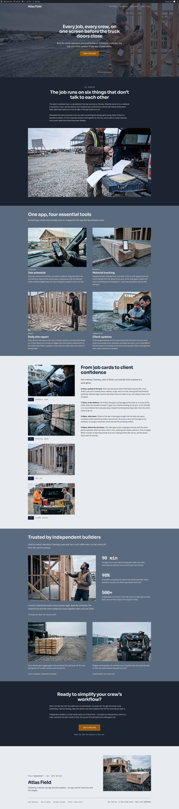
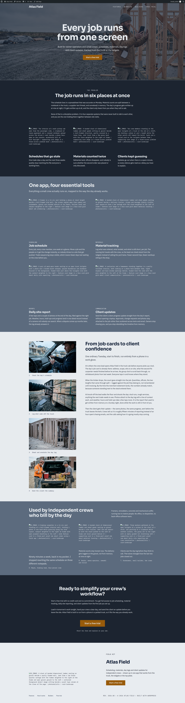
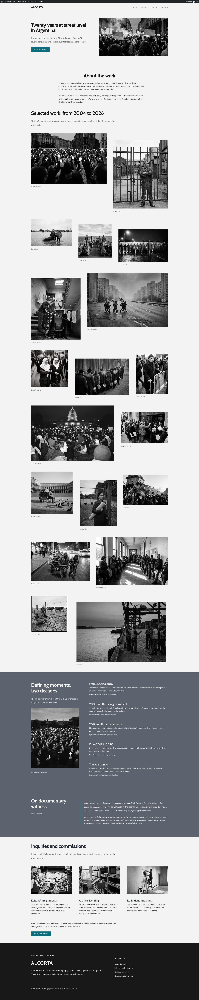
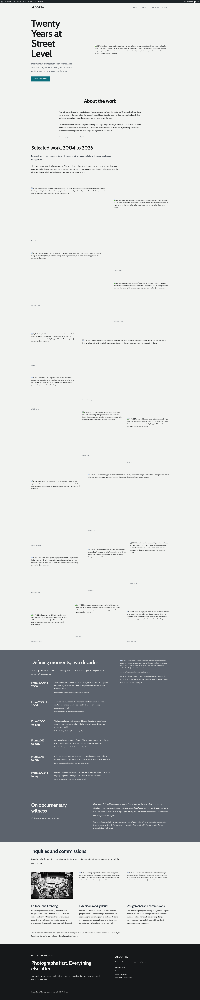

# BIGR-900 visual evidence

All captures use a 1920px-wide viewport. Atlas and portfolio were rebuilt from
`sections` through the complete deterministic delivery tail, so both hero
requests consumed the updated prompt contract.

## Atlas Field

Before: the hero H1 uses `section-title`, leaving the masthead close to the
ordinary section-heading scale.

After: the regenerated hero authors `display` directly and gives the first
screen a distinct masthead scale.

## ALCORTA portfolio

Before: the restrained split hero uses `section-title`, leaving `display`
unused.

After: the regenerated split hero authors `display` and wraps the concise H1
inside its narrow copy rail.

The after builds did not run the separate image-generation phase. Newly
requested lower-page image paths are therefore unresolved in those captures;
the rendered hero typography under test remains visible.
