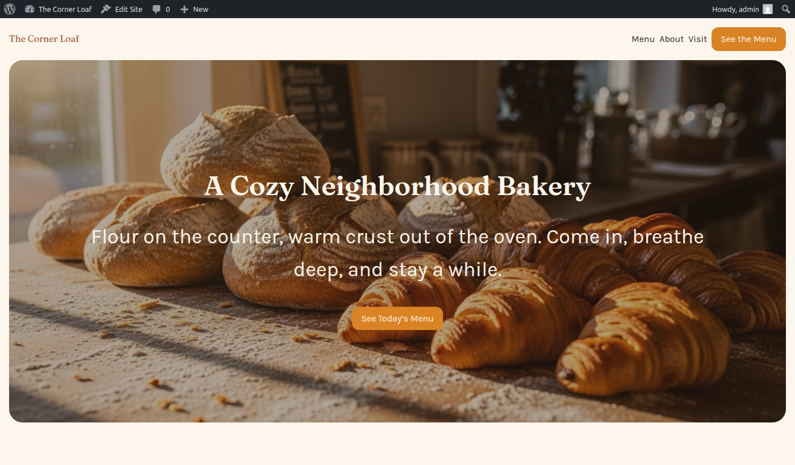
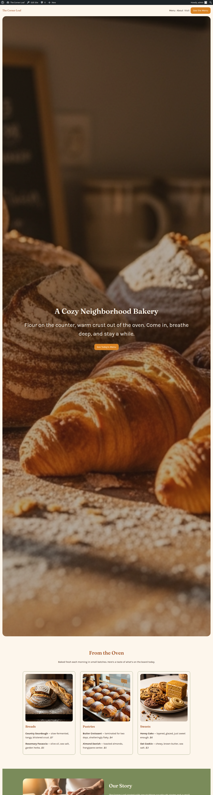

# Epic #7 — design-pipeline refactor: evidence

Real end-to-end build: `php bin/create.php "A cozy neighborhood bakery" --slug=bakery-test`
then `php bin/images.php bakery-test`, rendered in WordPress Playground.

## Rendered site — "The Corner Loaf"


*Hero: the design system from `design.md` flows end to end — Fraunces serif headings,
Karla body, cream `base` (#FDF6EC) chrome, honey-glaze `accent` (#D98324) CTAs.*


*Full landing page: hero + "From the Oven" menu cards (AI images) + sage-green
`secondary` (#7A8B5A) "Our Story" band. Every color/font is a declared theme.json
preset sourced from the `design.md` front matter.*

## siteSpec.json — before vs after (#1)

**Before** (mixed facts + design decisions):

```json
{
  "name": "Hearth & Crumb",
  "slug": "hearth-crumb",
  "tagline": "...",
  "description": "...",
  "audience": "...",
  "tone": ["warm", "homey"],
  "colors": { "mood": "...", "primary": "#8a5a2b", "secondary": "...", "background": "#fff", "text": "#111", "accent": "..." },
  "typography": { "mood": "...", "heading": "Fraunces", "body": "Source Sans 3" },
  "layout": "...",
  "pages": ["..."],
  "key_sections": ["Hero", "Specials", "About"]
}
```

**After** (factual info only — no colors/typography/layout):

```json
{
  "name": "The Corner Loaf",
  "slug": "the-corner-loaf",
  "title": "A Cozy Neighborhood Bakery",
  "site_type": "business storefront",
  "topic": "freshly baked goods from a local bakery",
  "area": "bakery",
  "audience": "local neighborhood residents and visitors seeking fresh baked goods",
  "visual_vibe": "warm, cozy, and inviting",
  "sections": ["Hero", "Menu", "About", "Visit"]
}
```

## design.md — DESIGN.md standard (#3)

`design.md` now opens with YAML token front matter (the authoritative palette/type
tokens downstream steps read), followed by the canonical body sections:

```yaml
---
name: The Corner Loaf
colors:
  base: "#FDF6EC"
  contrast: "#3A2A1E"
  primary: "#A65A2E"
  secondary: "#7A8B5A"
  accent: "#D98324"
typography:
  heading: { fontFamily: Fraunces, fontWeight: 600 }
  body: { fontFamily: Karla, fontSize: 1rem, lineHeight: 1.6 }
rounded: { sm: 6px, md: 12px, lg: 24px }
spacing: { sm: 8px, md: 16px, lg: 32px }
---
## Overview … ## Colors … ## Typography … ## Layout … ## Shapes … ## Components … ## Imagery … ## Do's and Don'ts
```

No `designDirection.json` is produced (#2): the build runs 4 LLM steps now
(site-spec → design-doc → theme-json → landing-page), down from 5.
