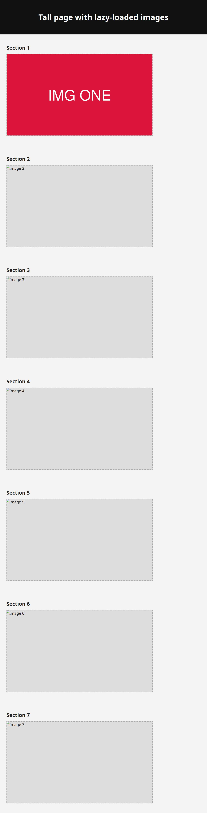
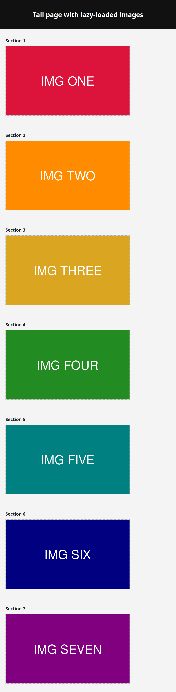

# Issue #31 — full-page screenshots miss lazy-loaded images: evidence

Full-page headless screenshots used to capture a tall page in one shot without
ever scrolling, so images far down the page that lazy-load (native
`loading="lazy"` or a JS `IntersectionObserver` keyed off scroll) were never
fetched and rendered as empty boxes.

The new capturer (`bin/screenshot/screenshot.js`) scrolls the page top-to-bottom
to trip every lazy-load trigger, promotes any remaining lazy images to eager,
and waits for all `document.images` to finish decoding before capturing.

## Reproduction

`fixture/index.html` is a tall page with seven `IntersectionObserver`-gated
images (only `Section 1` is in the initial viewport). Regenerate the images with
`fixture/make-images.sh` (needs ImageMagick), then:

```bash
cd docs/evidence/issue-31/fixture
php -S 127.0.0.1:8199 &

# Before — old behaviour (no scrolling pass):
node ../../../bin/screenshot/screenshot.js http://127.0.0.1:8199/index.html before.png --no-scroll

# After — with the lazy-load scroll/wait:
node ../../../bin/screenshot/screenshot.js http://127.0.0.1:8199/index.html after.png
```

## Before — `--no-scroll` (reproduces the bug)



Only `Section 1` (in the initial viewport) loaded. Sections 2–7 are empty dashed
boxes — the exact "empty box far down a tall page" symptom.

## After — with the fix



All seven images (`IMG ONE` … `IMG SEVEN`) render. The pre-capture scroll fired
each section's `IntersectionObserver`, and the capturer waited for every image to
decode before screenshotting.
