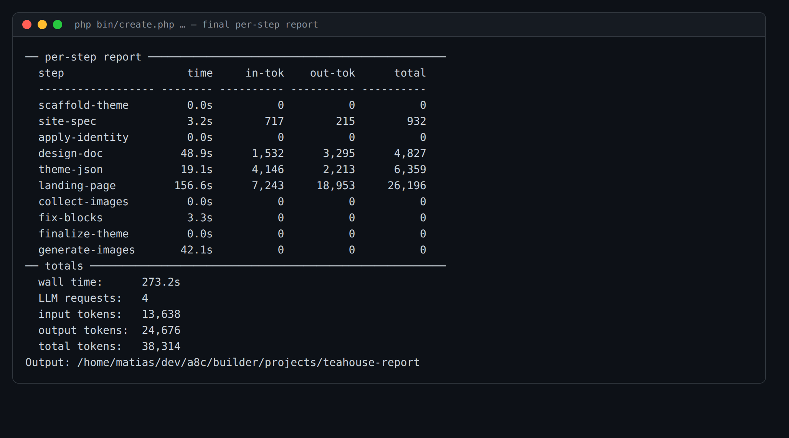

# Issue #4 — final per-step time/token report: evidence

Command: `php bin/create.php "A neighborhood tea house and loose-leaf tea shop" --slug=teahouse-report --no-serve --with-images`

After the build, a single consolidated **per-step report** prints — each step's
wall time, input tokens, output tokens, and total — followed by the totals block.
Deterministic (non-LLM) steps show `0` rather than blank, and the opt-in
`generate-images` step is included (time + 0 tokens, since it makes no LLM calls).



`build-stats.json` now also carries a `steps` array with the same breakdown:

```json
{
  "wall_seconds": 273.2,
  "requests": 4,
  "input_tokens": 13638,
  "output_tokens": 24676,
  "total_tokens": 38314,
  "steps": [
    { "id": "scaffold-theme", "seconds": 0,   "input_tokens": 0,    "output_tokens": 0,     "total_tokens": 0 },
    { "id": "site-spec",      "seconds": 3.2, "input_tokens": 717,  "output_tokens": 215,   "total_tokens": 932 },
    { "id": "design-doc",     "seconds": 48.9,"input_tokens": 1532, "output_tokens": 3295,  "total_tokens": 4827 },
    { "id": "theme-json",     "seconds": 19.1,"input_tokens": 4146, "output_tokens": 2213,  "total_tokens": 6359 },
    { "id": "landing-page",   "seconds": 156.6,"input_tokens": 7243,"output_tokens": 18953, "total_tokens": 26196 },
    { "id": "generate-images","seconds": 42.1,"input_tokens": 0,    "output_tokens": 0,     "total_tokens": 0 }
  ]
}
```
