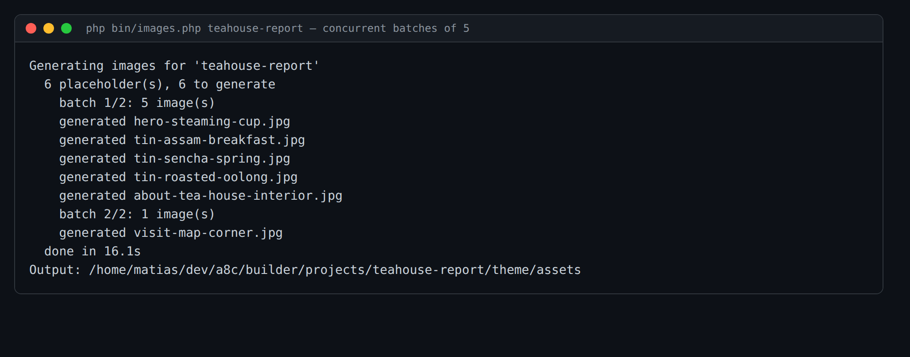

# Issue #5 — concurrent image batching: evidence

Images are now generated in **concurrent batches of 5** instead of one at a time.

Command: `php bin/images.php teahouse-report` (6 placeholders) — equivalently
`php bin/create.php "…" --with-images`.

The step processes the pending images in chunks of `BATCH_SIZE = 5`: the first 5
fire together (`batch 1/2`), then the remaining 1 (`batch 2/2`). All 6 JPEGs land
in `theme/assets/`.

**Timing:** 6 images in **16.1s** batched, versus ~42–46s for the same count under
the previous one-by-one path (≈7–8s/image × 6) — roughly the time of one
round-trip per batch instead of one per image.

Mechanics:
- `WpcomImageClient::generateBatch(array $specs)` issues the requests together via
  `curl_multi_*` and returns one `{ok, bytes|error}` result per spec.
- Transient failures (429/5xx/stall) are retried — only the still-failing handles,
  with the same `[2, 5, 12]` backoff as the single path.
- Partial failures are isolated: one image failing (generation **or** disk write)
  marks just that spec `failed` and never aborts the rest. `images.json` is
  persisted after each batch.
- The `theme:` → served-URL rewrite still runs once after all batches finish.
