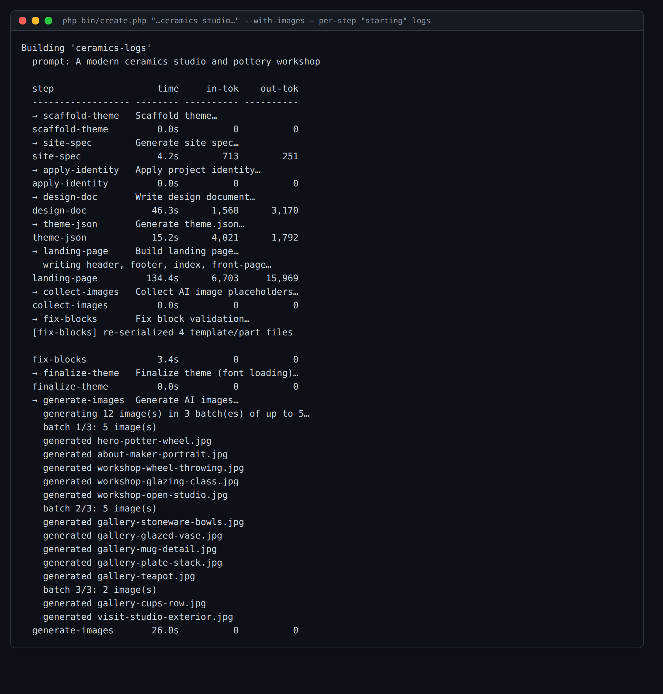

# Issue #6 — per-step "starting" logs: evidence

The build now prints a `→ <step>: <label>…` line at the **start** of every step,
before the step runs — so there is always visible progress and the build never
looks frozen while a long step is mid-flight.

Command: `php bin/create.php "A modern ceramics studio and pottery workshop" --slug=ceramics-logs --no-serve --with-images`

What this shows:
- A `→ <id> <label>…` line is emitted **before** each step's `run()` (via a new
  `onStart` hook on `Pipeline::runThrough`), ahead of the per-step completion row.
- The slowest LLM step announces its work up front: `landing-page` →
  `writing header, footer, index, front-page…` (so the ~2-minute step isn't silent).
- The image step shows live batch progress: `generating 12 image(s) in 3 batch(es)
  of up to 5…`, then `batch 1/3 … batch 3/3` and each `generated <file>.jpg`.
- Logs flush immediately (`flush()` on the start line; the long steps write to
  unbuffered STDERR), so they appear in real time rather than after the step ends.

(The block-fixer's verbose validation dump in the middle was collapsed to one line
for readability.)
